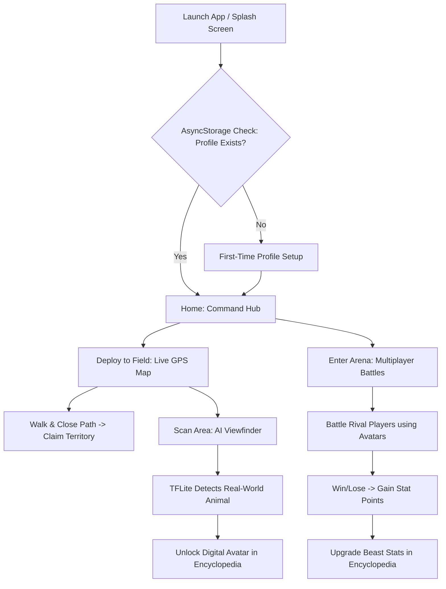

# 🐾 Zoodex: Comprehensive Product Requirements & Technical Design Document (PRD & TDD)

This document serves as the absolute, exhaustive source of truth and architectural blueprint for **Zoodex**, a mobile-native, physical-world territory claiming and strategic turn-based animal combat game. It is designed to be built as a **React Native (TypeScript) Android project** that compiles and runs natively within **Android Studio**.

---

# Part 1: Product Requirements Document (PRD)

## 1.1 Project Overview & Mission
Zoodex merges GPS spatial tracking, on-device Computer Vision (AI), and elements of classic tactical RPGs. Operatives claim real-world territories by walking physical paths, capture digital creatures using live-camera AI verification, and form a combat roster to defend their domain in turn-based matches.

### Target Aesthetics
The application must present a unified **High-Tech Tactical HUD / Cyberpunk Terminal** visual style. 
- **Base Canvas:** `#0A0E14` (Midnight Space Blue/Black).
- **Primary Accent (Cyber Lime):** `#CCFF00`
- **Secondary Accent (Volt Violet):** `#BF00FF`
- **Typography:** Monospaced, tech-focused fonts (e.g., `Roboto Mono` or `Share Tech Mono`), glowing text shadows, and transparent glassmorphism (`rgba(255,255,255,0.05)`).

---

## 1.2 Core Game Loop


---

## 1.3 In-Depth Feature Breakdown & Mechanics

### Feature 1: The Capture Protocol (Real-World to Digital)
The core loop relies on physical exploration and real-world interactions.
*   **The Action:** The user taps `[ SCAN AREA ]` and their phone's camera opens. They point the camera at a real-world animal (e.g., a real dog walking in the park, a bird on a fence, a lizard).
*   **The AI Detection (TFLite):** The on-device AI scans the video feed. When it detects the real-world species with high confidence (e.g., `Canine detected: 92%`), the screen locks on with a cybernetic reticle.
*   **Digital Translation:** The real-world animal is immediately "digitized" and translated into a Zoodex game avatar. 
    *   *Real Dog -> "Volt Hound" (Electric Type)*
    *   *Real Bird -> "Storm Eagle" (Air Type)*
    *   *Real Snake -> "Venom Python" (Earth Type)*
*   **Unlocking:** The beast is instantly unlocked in the user's **Encyclopedia** and available to be slotted into the active 5-Beast Roster.

### Feature 2: The Encyclopedia (Zoodex) & Roster Manager
The Encyclopedia serves as the ultimate database for the player.
*   **Visual Grid:** A highly stylized grid of all captured animal avatars. Undiscovered animals show up as dark, corrupted static silhouettes.
*   **Beast Details:** Tapping a captured beast opens its detailed holographic profile, showing:
    *   **Lore & Element Type** (Fire, Water, Air, Earth, Electric).
    *   **Level and EXP Bar**.
    *   **Base Stats:** HP, Attack, Defense, Speed.
*   **The 5-Beast Roster:** Players can own an infinite number of animals in their Encyclopedia, but they must strictly select **5 Avatars** to form their "Active Arena Roster". Only these 5 can be taken into battle.

### Feature 3: The Battle Arena & Stat Upgrades (RPG Progression)
The Arena is where operatives pit their captured avatars against other players.
*   **Multiplayer Matchmaking:** Players can challenge random operatives or specific friends. 
*   **Combat:** Turn-based combat governed by a strict Type-Effectiveness Matrix (e.g., Water extinguishes Fire, Fire burns Air, Air erodes Earth).
*   **Post-Battle Progression (Stat Points):**
    *   After every battle, the participating beasts gain EXP.
    *   Upon leveling up, the player is awarded **Unallocated Stat Points** (e.g., +3 points).
    *   **Upgrading Beasts:** The player goes to the Encyclopedia, selects the beast, and manually allocates these points. Want a glass cannon? Dump all points into *Attack*. Want a tank? Dump points into *Defense* and *HP*. This makes every player's "Storm Eagle" mathematically unique based on how they train it.

### Feature 4: GPS Territory Wars (The Map)
The physical world is a shared multiplayer game board.
*   **The Snake Mechanic:** As the user physically walks outside with the app open, their GPS leaves a glowing neon trail behind them on the dark satellite map.
*   **Closing the Polygon:** When the user walks in a full circle and crosses their own path, the enclosed shape solidifies into a colored polygon (matching their Faction color).
*   **Stealing Land:** If a user walks a circle that overlaps another player's existing polygon, the backend spatial database (`PostGIS ST_Difference`) mathematically carves that piece out. The new user literally "steals" that chunk of real estate in real-time.

### Feature 5: Operative Comms (Friend Chat & Social)
Because territory wars require coordination, operatives need to communicate.
*   **Comms Link (Chat Interface):** A global and private messaging system themed like an encrypted military terminal.
*   **Friends List:** Users can add rivals or allies via their Callsigns.
*   **Direct Challenges:** From the chat window, a user can tap `[ INITIATE BATTLE ]` to send a direct Arena challenge to that friend.

---

## 1.4 Baseline Screen Requirements

1. **Splash Screen:** Animated terminal loading bar checking location permissions.
2. **First-Time Setup:** Callsign creation and Faction selection (No email/password login required).
3. **Command Hub (Home):** Dashboard showing active zones, beast counts, and navigation cards.
4. **Deploy to Field (Map):** Live GPS drawing, rendering rival polygons, and the Scan trigger.
5. **AI Viewfinder (Camera):** Live camera feed enforcing "no gallery upload" rules for capturing real animals.
6. **The Encyclopedia:** Grid of beasts, stat point allocation UI, and Roster selection.
7. **Arena Protocol:** Turn-based multiplayer battle interface with animated health bars.
8. **Operative Comms:** Friend list and real-time encrypted chat UI.

---

# Part 2: Technical Design Document (TDD)

## 2.1 System Architecture & Tech Stack

| Layer | Technology | Justification |
| :--- | :--- | :--- |
| **Mobile Frontend** | React Native (0.73+), TypeScript | Cross-platform capability, fast UI iteration, native module access. |
| **Native IDE** | Android Studio, Gradle | Required for compiling custom native camera and TFLite bindings. |
| **Backend API** | Python 3.11+, FastAPI | Extremely high throughput, native async support, WebSockets for chat/battle. |
| **Database** | PostgreSQL 15 + PostGIS 3 | Industry standard for complex spatial queries (`ST_Difference`, `ST_Intersects`). |
| **Real-Time** | WebSockets / Socket.io | Required for live Friend Chat and turn-based Multiplayer Arena. |

---

## 2.2 Database Schema (PostgreSQL/GeoAlchemy2)

### Table: `users`
```sql
CREATE TABLE users (
    id UUID PRIMARY KEY DEFAULT uuid_generate_v4(),
    username VARCHAR(15) UNIQUE NOT NULL,
    team_color VARCHAR(7) NOT NULL,
    created_at TIMESTAMP WITH TIME ZONE DEFAULT NOW()
);
```

### Table: `territories` (Spatial Overwrites)
```sql
CREATE TABLE territories (
    id UUID PRIMARY KEY DEFAULT uuid_generate_v4(),
    owner_id UUID REFERENCES users(id),
    area_polygon Geometry(MULTIPOLYGON, 4326) NOT NULL,
    captured_at TIMESTAMP WITH TIME ZONE DEFAULT NOW()
);
CREATE INDEX idx_territories_polygon ON territories USING GIST (area_polygon);
```

### Table: `captured_animals` (Player Inventory & Upgrades)
```sql
CREATE TABLE captured_animals (
    id UUID PRIMARY KEY DEFAULT uuid_generate_v4(),
    owner_id UUID REFERENCES users(id),
    species_name VARCHAR(50) NOT NULL,
    element_type VARCHAR(20) NOT NULL,
    level INT DEFAULT 1,
    exp INT DEFAULT 0,
    unallocated_stat_points INT DEFAULT 0,  -- Earned from winning battles
    base_hp INT,
    base_attack INT,
    base_defense INT,
    base_speed INT,
    in_battle_roster BOOLEAN DEFAULT FALSE,
    capture_location Geometry(POINT, 4326),
    captured_at TIMESTAMP WITH TIME ZONE DEFAULT NOW()
);
```

### Table: `friend_messages` (Operative Comms)
```sql
CREATE TABLE friend_messages (
    id UUID PRIMARY KEY DEFAULT uuid_generate_v4(),
    sender_id UUID REFERENCES users(id),
    receiver_id UUID REFERENCES users(id),
    message_content TEXT NOT NULL,
    sent_at TIMESTAMP WITH TIME ZONE DEFAULT NOW(),
    is_read BOOLEAN DEFAULT FALSE
);
```

---

## 2.3 The Spatial Override Engine (PostGIS Mechanics)

The defining mechanic of Zoodex is that claiming territory is destructive. If User A walks a circle over User B's territory, User A *steals* that exact intersecting chunk.

### The FastAPI Transaction (Pseudo-Code)
```python
@router.post("/claim")
async def claim_territory(claim: TerritoryClaim, db: Session = Depends(get_db)):
    new_poly_wkt = f"POLYGON(({','.join([f'{lng} {lat}' for lat, lng in claim.coordinates])}))"
    try:
        # Step A: Carve out overlapping space from ALL existing territories using ST_Difference
        db.execute(text("""
            UPDATE territories
            SET area_polygon = ST_Multi(ST_Difference(area_polygon, ST_GeomFromText(:new_poly_wkt, 4326)))
            WHERE ST_Intersects(area_polygon, ST_GeomFromText(:new_poly_wkt, 4326))
        """), {"new_poly_wkt": new_poly_wkt})

        # Step B: Delete territories that were completely swallowed
        db.execute(text("DELETE FROM territories WHERE ST_IsEmpty(area_polygon) = TRUE"))

        # Step C: Insert the new territory cleanly
        db.execute(text("""
            INSERT INTO territories (owner_id, area_polygon)
            VALUES (:user_id, ST_Multi(ST_GeomFromText(:new_poly_wkt, 4326)))
        """), {"user_id": claim.user_id, "new_poly_wkt": new_poly_wkt})
        
        db.commit()
        return {"success": True}
    except Exception as e:
        db.rollback()
```

---

## 2.4 On-Device TFLite AI Vision Pipeline

To process animal detection with zero latency and offline support without gallery uploads.

*   **Model:** Quantized MobileNet SSD (`.tflite`) trained on COCO dataset (Dogs, Cats, Birds, Reptiles, etc.).
*   **Android Integration:** React Native uses `react-native-vision-camera` passing YUV frames via a Frame Processor to `react-native-fast-tflite`.
*   **Logic:**
    1. Camera renders at 60FPS.
    2. Model scans every 3rd frame (to save battery).
    3. If label `Bird` is detected with `> 80%` confidence -> System translates `Bird` to `Storm Eagle`.
    4. Target locks -> User presses `CAPTURE`.

---

## 2.5 Strategic Turn-Based Battle Loop & Math

### Damage Formula & Upgrades
Damage in the Arena is heavily influenced by how the player has assigned their **Stat Points**.

```typescript
function calculateDamage(attacker, defender): number {
  // Base power of the strike
  const basePower = 40; 
  
  // Attack / Defense ratio (this is where player upgrades matter!)
  const statRatio = attacker.base_attack / defender.base_defense;
  
  // Type Effectiveness (e.g. Water hitting Fire = 2.0)
  const typeMultiplier = TypeEffectiveness[attacker.element_type].strongAgainst === defender.element_type ? 2.0 : 1.0;
  
  const rawDamage = (((attacker.level * 2 / 5 + 2) * basePower * statRatio) / 50 + 2);
  return Math.floor(rawDamage * typeMultiplier);
}
```

---

## 2.6 Mobile Android Compilation & Gradle Setup

Since this is built from scratch via Android Studio, native configuration is paramount to ensure the TFLite models don't crash.

### `/android/app/build.gradle` (App Level)
```groovy
android {
    namespace "com.zoodex.app"
    compileSdkVersion 34

    defaultConfig {
        applicationId "com.zoodex.app"
        minSdkVersion 26 // Required for CameraX
        targetSdkVersion 34
    }
    
    // CRITICAL: Prevent Android from compressing the TFLite models during APK packaging
    aaptOptions {
        noCompress "tflite"
    }
}
```

---
*End of PRD & Design Document.*
