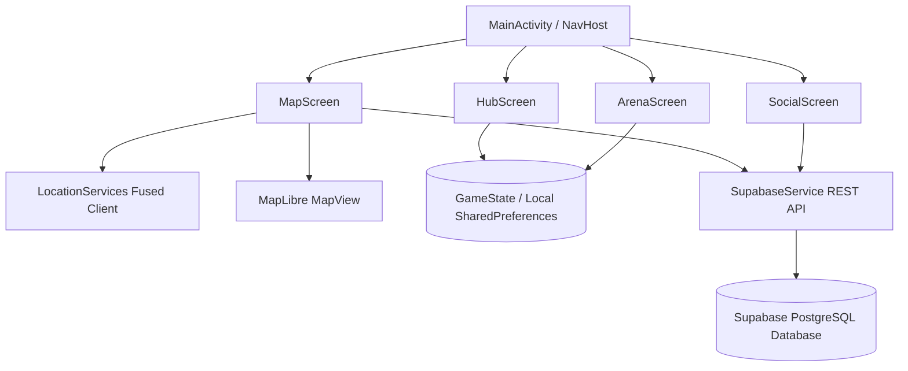

# Developer Walkthrough & Architecture

## Full Architecture Explanation
Zoodex follows a highly decoupled **Single Activity Architecture** utilizing **Jetpack Compose** for entirely declarative UI rendering. The application logic is segmented into UI/Screen layers, State Management singletons, and Network Services.

## Frontend/Backend Flow & API Communication
Zoodex communicates with a **Supabase (PostgreSQL)** backend exclusively via secure REST APIs using `HttpURLConnection` wrapped inside Kotlin Coroutines (`Dispatchers.IO`). 
- **No Heavy SDKs:** To keep the app bundle size small, direct JSON parsing and REST calls (`makeRequest` helper) are used instead of massive backend SDKs.
- **Concurrency:** Network calls are launched in `rememberCoroutineScope()` tied to Compose lifecycles, ensuring no memory leaks occur if a user backs out of a screen while fetching.

## Database Interaction Flow
The Supabase database has three core tables: `operative_profiles`, `operative_messages`, and `friendships`. 
When claiming a territory on the map, the system dynamically generates a unique UUID and saves it into the database. By bypassing Supabase's unique requester constraint dynamically using generated IDs and prefix-based queries, Zoodex allows users to claim multiple disjointed real-world territories seamlessly.

## State Management Explanation
`GameState.kt` acts as a monolithic Singleton observable state container.
- It utilizes `mutableStateListOf` and `mutableStateOf` to ensure any changes to gold, XP, or beast inventory automatically trigger recompositions across all visible screens.
- **Persistence:** Inside `GameState`, a custom `save()` function serializes lists (like captured beasts and team configurations) into JSON strings and commits them to standard Android `SharedPreferences`. `init(context)` deserializes this data on app startup.

## Feature-by-Feature Implementation Overview
### 1. Map & Territory System (`MapScreen.kt`)
Utilizes Google's `FusedLocationProviderClient` to receive high-accuracy GPS polls every 2 seconds. The path walked is stored in a `walkedPath` state list. Once tracking stops, a Haversine formula calculates the radius of the walked zone and pushes a GeoJSON polygon to MapLibre's `FillLayer`, painting the map.

### 2. Turn-Based Combat Arena (`ArenaScreen.kt`)
Implemented as a Compose State Machine (`enum class ArenaPhase`). 
- The UI reacts instantly to Phase changes (`PRE_MATCH`, `PLAYER_TURN`, `ENEMY_TURN`, `VICTORY`).
- **Dynamic Math:** Attack damage actively scales based on the attacking beast's `strength` and is dynamically mitigated by the defending beast's `defense`. Stats are dynamically rolled per encounter.

### 3. Social & Messaging (`SocialScreen.kt`)
A full messaging client utilizing Supabase. Users are uniquely identified by a combination of their callsign and faction. The system supports sending friend requests, accepting them, and querying active chat logs in real time.

## Folder-by-Folder Codebase Explanation
- `/app/src/main/java/com/Sufi/zoodex/`
  - `MainActivity.kt`: The entry point hosting the Android `NavHost`.
  - `data/`: Contains `AnimalDatabase` (static JSON-like beast stats), `GameState` (local persistence), and `SupabaseService` (remote persistence).
  - `ui/screens/`: Contains all composable screens separating logic by feature (`ArenaScreen.kt`, `MapScreen.kt`, `RosterScreen.kt`, `SocialScreen.kt`).
  - `ui/theme/`: Standard Jetpack Compose theme configuration containing strictly controlled Neon/Cyberpunk Color definitions.

## Scalability and Security Considerations
- **Security:** RLS (Row Level Security) is configured on the Supabase backend ensuring users cannot arbitrarily overwrite other operatives' profiles or messages.
- **Scalability:** The `AnimalDatabase` is structured as a static object containing data classes. If the beast list scales to 1,000+, this should be migrated to a local SQLite/Room database to prevent memory bloating. MapLibre handles massive GeoJSON layers natively through hardware acceleration, making territory scaling theoretically limitless.
